 

# Temas

- Introducción
- Configuración Inicial
- Flujo Básico
- De master a main
- Ayuda
- Ignorar archivos
- Clonar repositorios
- Ramas
- Fusiones
- Cambios
- Registro del historial
- Reseteo del historial
- Resetear un repositorio
- Remotos
- Etiquetas
- GitHub Pages
- Colaboración en GitHub
- Aprende más

# Git & GitHub - JonMircha

Git es un software de conrtol de versiones distribuido y descentralizado que permite a un equipo de desarrolladores trabajar sobre el mismo código.

Se denomina **"distribudido"** porque cada mienbro del equipo dispone de una copia completa de código.

Los miembros del equipo pueden enviarse código, recibirlo y desarrollar funcionalidades de forma conjunta y separada del servidor central.

## Algunas ventajas de usarlo

- Es el estandar actual
- Código colaborativo, vresionado y distribuido
- Recupareción de archivos
- Mayor control
- Shorcuts y plugins
- Mejora la productividad
- Imagen Git

## Diferencias entre Git & GitHub

**Git**:

- Es un sistema de control de versiones.
- Permite llevar un registro de los cambios en archivos y coordinar el trabajo en esos archivos entre varias personas.
- Se instala y se usa localmente en tu computadora.
- Te permite crear "repositorios" donde puedes almacenar la historia completa de los cambios en tus proyectos.

**GitHub**:

- Es una plataforma en línea que aloja repositorios Git.
- Proporciona una interfaz gráfica para manejar tus repositorios.
- Facilita la colaboración en proyectos, permitiendo que varias personas trabajen juntas, comenten y revisen cambios.
- Ofrece funciones adicionales como control de acceso, seguimiento de problemas, y GitHub Pages para publicar sitios web estáticos.

En resumen:

- **Git** es la herramienta que usas para llevar el control de versiones.
- **GitHub** es un servicio que aloja tus repositorios Git y proporciona herramientas para colaborar y gestionar proyectos.

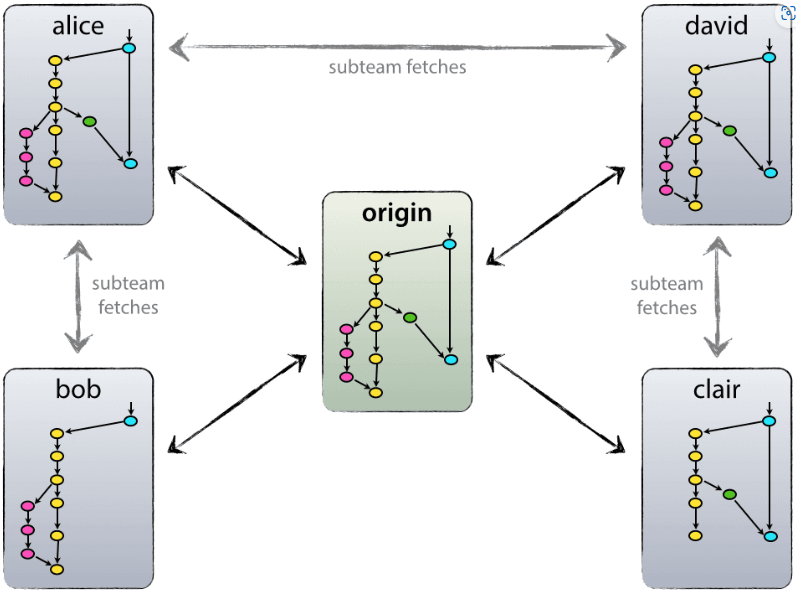

## Configuración Inicial

### Configurando Git por primera vez

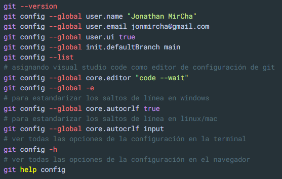

### Inicializar Git en un directorio local

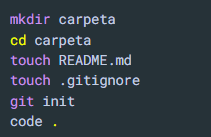

## Flujo Básico

El flujo de _Git_, consta de tres estados locales, es decir en la computadora donde se está trabajando y uno más de forma remota cuando accedemos al código centralizado en platadormas como GitHub, Gitlab, Bitbucket, etc.

Dichos estados con **modified**, **stage**, **committed** y **remote** A cada uno de ellos les corresponde un área de trabajo:

1. **Working Directory**: Es el área correspondiente al estado **_Modified_** y es la carpeta local de tu computadora donde se almacenan los archivos de tu proyecto. El estado **_Modified(Modificado)_**, hace referencia ha que se han realizado cambios en el _archivo(Editado)_, pero aún no se han prepadarado esos cambios para ser confirmados. Ejemplo: Se ha editado un o varios archivos de código, pero no has indicado a _Git_ que quieres incluir esos cambios al proximo commit.

1. **Staging Area(Área de Preparación):** Es el área correspondiente al estado **_Stage(preparación)_**, tambien se le llama index porque es el área donde _git_ indexa (área intermedia donde se almacenan los cambios antes de confirmarlos - zona de espera donde puedes seleccionar y revisar los cambios que deseas incluir enntu próximo commit) y agrega los cambios realizados en los atchivos previos a comprometerlos en su registro. Ejemplo: Después de editar un archivo, decides que está listo para ser guardado en el historial de cambios. Usas _git add_ para moverlo al área de preparación _(staging area)_. **git add**: Este comando se usa para agregar cambios al índice git add archivo.txt

1. **Local Repository(Repositorio Local)**: Es el área correspodiente al estado **_Committed_**, en esta se guardan los cambios en el historial de _Git_. Estos cambios ahora estan en tu repositorio local. Ejmplo: Despues de preparar los cambios, los confirmas para que se añadan al historial de _Git_ o _HEAD_, creando un punto de referencia en el proyecto. **git commit -m** "Mensaje del commit"

1. **Remote Repository(Repositorio Remoto)**: Es el área correspondiente al estado **_Remote_** y es el directorio remoto donde se almacena una versión del proyecto o los archivos del proyecto en alguna plataforma web como _GitHub_, _GitLab_, _BitBucket_ etc. _Git_ denomina _origin_ al repositorio remoto.Y permite colaborar y sincronizar tu trabajo con otros. Ejemplo: Después de hacer commits en tu repositorio local, puedes enviar esos cambios al repositorio remoto para compartirlos con otros o para tener una copia de seguridad.

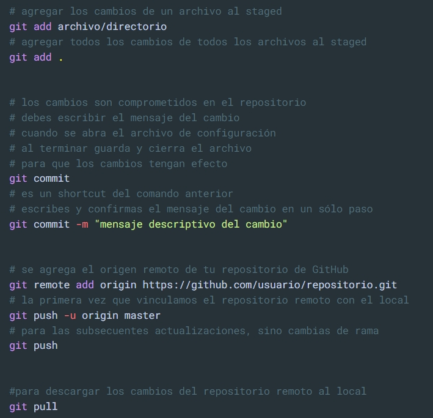

## Ignorar Archivos

En el archivo **_.gitignore_** colocamos todo lo archivo que **NO** deseemos incluir en nuestro repositiorio. Lo podemos crear manualmente o con _.gitignore.io_

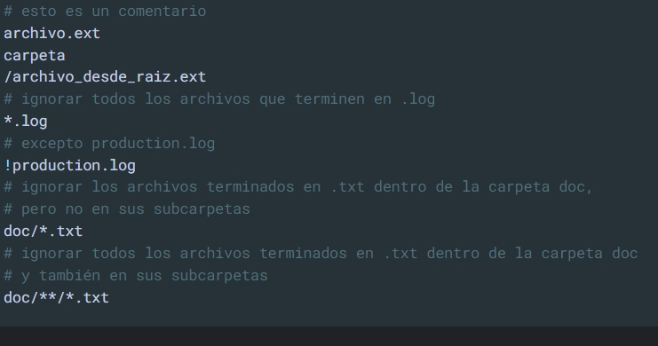

## Clonar Repositorios

Para realizar la clonación de un repositorio, nos dirigimos a la URL del repositorio, la copiamos, abrimos la terminal de comandos y utilizamos el comando `git clone` seguida de la URL del repositorio que deseamos clonar. Finalmente para verificar la clonación usamos el comando `ls`

`git clone https: //github.com/usuario/repositorio.git`

## Ramas

Una rama es como una línea de desarrollo separada dentro de un proyecto. Es como una copia en la que se puede trabajar si afectar la versión principal del proyecto(main). En otras palabras nos permite aislar una nueva funcionalidad en nuestro código la cual después podremos añadir a la versión principal.

Pasos:

1. **Rama Principal(main/master)**: Esta es la línea de desarrollo principal donde normalmente se encuentra el código más estable y listo para producción.

1. **Crear una Nueva Rama**: Cuando quieras trabajar en una nueva funcionalidad o corregir un error, creas una nueva rama. Esto permite realizar cambios sin alterar la rama principal.

1. **Trabajaar en la Nueva Rama**: Realizas todos tus cambios en esta nueva rama. Puedo realizar commits y pruebas sin preocuparme por romper nada en la rama principal.

1. **Funcionar (merge)**: Una vez que termino de trabajar y todo está probado, puedo fusionar mi rama con la rama principal. Esto incorpora todos mis cambios al código estable.

1. **Eliminar la Rama**: Despúes de fusionar, puedes eliminar la rama ya que los cambios han sido incorporados a la rama principal.

**Nota**: Si quiero que una rama en la cual estoy trabajando exista en remoto, debo de escribir este comando al momento de realizar el git push: `git push -u origin "nombre-nueva-rama"`
Para eliminar una rama remota escribo el siguiente comando: `git push origin --delete "nombre-rama"`

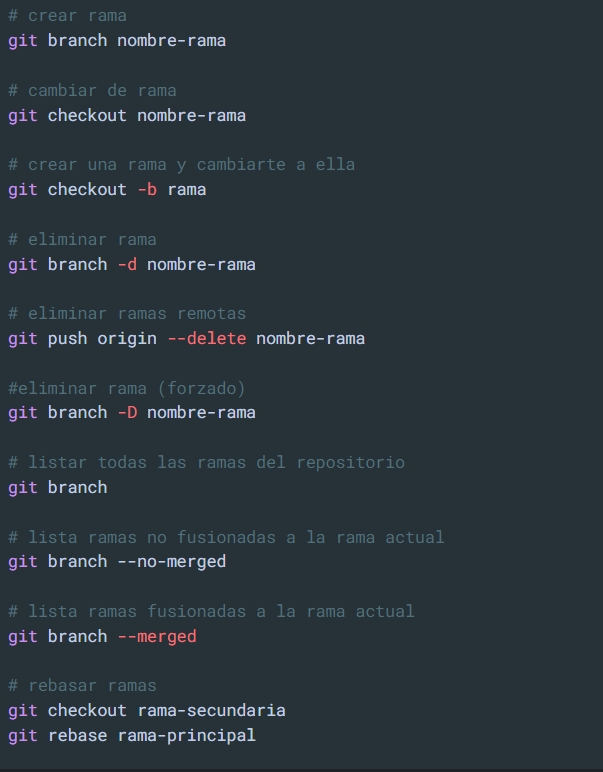

## Fusiones

Une dos ramas. Para ahcer una fusión necesitamos:

1. Situarnos en la rama que se quedará en el contenido fusionado.
1. Fusionar.

Cuando se fusionan ramas se pueden dar 2 resultados diferentes:

- **_Fast-Forwad:_**: La fusión se hace automática, no hay conflictos por resolver.
- **_Manual Merge_**: La fusión hay que hacerla maual, para resolver conflictos de la duplicación de contenido.

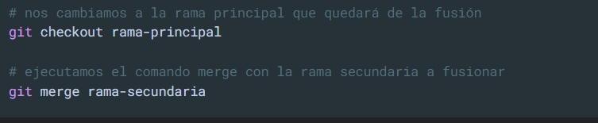

## Cambios

Puedes agregar modificaciones al ultimo cambio

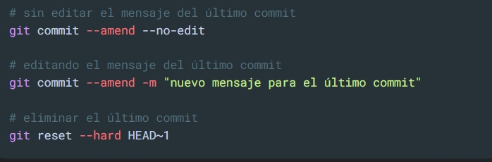

Podemos desplazarnos en el historial del repositorio hacia atrás o adelante en cambios o ramas, sin afectar el respositorio como tal. Nota: Se recomienda `NO` realizar el `push` antes de hacer el cambio en el `commit` puesto que dicha acción traera conflictos entre el archivo en local y el remoto.

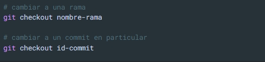

## Registro del Historial

**_Git log_** nos permite conocer todo el historial de un proyecto, con la información de fecha, el autor y el id de cada cambio. Para salir de este se presiona la tecla `q`.

La opción `git log --oneline --graph --all`, nos permite ver los direferentes `commits` en forma gráfica.

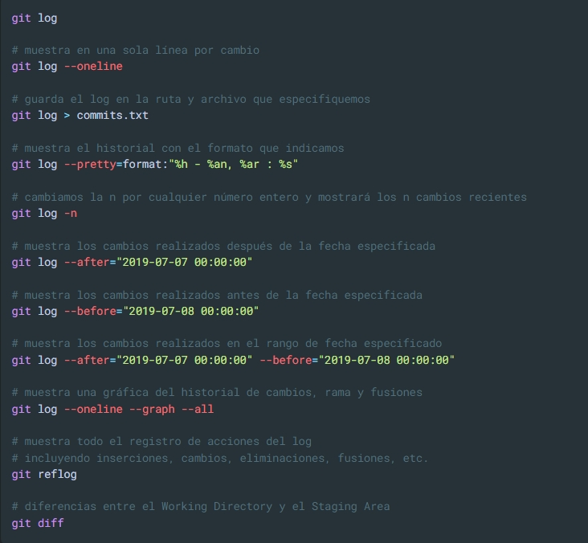

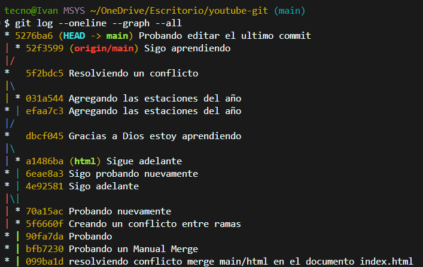

## Reseteo del Historial

Podemos eliminar el historial de cambios del proyecto hacia adelante con respecto de un punto de referencia.

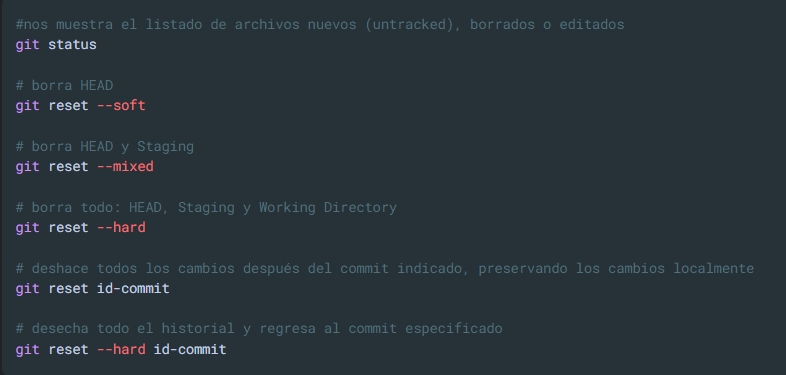

## Resetear un Repositorio

Si en algun momento tienes la necesidad de resetear el historial de cambios de un repositorio para que quede como si lo acabarás de crear, ejecuta esta serie de comandos.

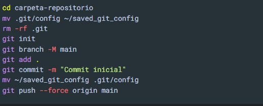

## Etiquetas

Con esta opción **_git_** nos permite versionar (asignar un número de versión) a nuestro código , librería o proyecto. Ej: `v1.0.0`

Para profundizar en la nomenclatura de tres número, la cuál hace referencia a la implementación del control de versiones samántico, podemos ingresar a `https://semver.org/`.

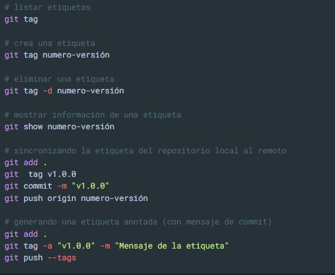

## GitHub Pages

[**gh-pages**](https://pages.github.com/) es una rama especial para crear un sitio _web_ a tu proyecto alojado directamente en tu repositorio de _GitHub_.

- _URL_ del repositorio: **https://githube.com/usuario/repositorio**

- _URL_ del sitio: **https://usuario.github.io/repositorio**

Para crear esta rama especial en GitHub ejecutamos los siguientes comandos:

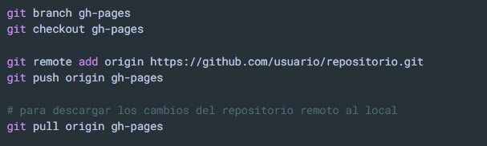

## Colaboración en **GitHub**

Para poder colaborar en proyectos alojados en _GitHUb_ necesitamos hacer uso de los _forks_ y _pull re-quests_, herramientas que nos ofrece la plataforma para dicho objetivo.

Acontinuación se describe el proceso de colaboración en _GitHub_:

1. _Forkea_ el repositorio en el que quieres colaborar, para hacerlo, sigue las instrucciones de este [enlace](https://docs.github.com/en/pull-requests/collaborating-with-pull-requests/working-with-forks/fork-a-repo).

1. Una vez _forkeado_ el repositorio en tu cuenta de _GitHub_, clónalo en tu computadora.

1. En el repositorio local hay que configurar los orígenes remotos de tu nueva copía para tener ambos remotos, los originales (_origin_) y los de tu copia, para hacerlo, sigue las instrucciones de este [enlace](https://docs.github.com/en/pull-requests/collaborating-with-pull-requests/working-with-forks/fork-a-repo).

1. Crea una rama nueva en tu _fork_ local par ahacer tu colaboración, y sincrónizala con tu repositorio remoto, para hecerlo, sigue las instrucciones de este [enlace](https://docs.github.com/en/pull-requests/collaborating-with-pull-requests/working-with-forks/syncing-a-fork).

1. Configura tu repositorio para que acepté cambios (_pull request_), para hacerlo, ve al siguiente [enlace](https://docs.github.com/en/pull-requests/collaborating-with-pull-requests/working-with-forks/allowing-changes-to-a-pull-request-branch-created-from-a-fork).

1. Crea una _pull request_, para hacerlo, ve al [enlace](https://docs.github.com/en/pull-requests/collaborating-with-pull-requests/proposing-changes-to-your-work-with-pull-requests/creating-a-pull-request).

1. Espera a que el dueño del repositorio original, acepte tus cambios.

1. Una vez que acepte tu _pull request_, es recomendable que borres la rama en la que trabajaste el cambio y actualices tu repositorio _forkeado_, con los cambios del repositorio original. 

Resumen de los comandos a ejecutar para colaborar en un repositorio de _GitHub_:

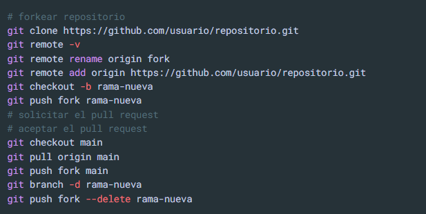

### Nota: Despejando Dudas (- by - ChatGPT -)

**_Forkear_** un repositorio en GitHub significa hacer una copia del repositorio de otra persona o proyecto en tu cuenta de GitHub. Este concepto es muy útil en el trabajo colaborativo, ya que te permite:

- Experimentar sin riesgos: Puedes hacer cambios en tu copia sin afectar el repositorio original.

- Contribuir al proyecto original: Después de hacer cambios en tu copia (fork), puedes proponer que estos cambios se incorporen al proyecto original mediante un pull request. El dueño del repositorio original puede revisar tus cambios y, si los considera útiles, integrarlos.

**Resumen:**

- **Fork** = Copia de un repositorio en tu cuenta.
- **Propósito**:Trabajar en un proyecto sin afectar el original.
- **Contribución**: Puedes proponer tus mejoras al proyecto original a través de un pull request.

Este proceso es fundamental en proyectos de código abierto, donde muchas personas colaboran en el mismo proyecto.

**_Pull Request_** en GitHub es una solicitud para que los cambios que has hecho en tu copia de un repositorio (fork) se integren en el repositorio original.

**¿Cómo funciona un pull request?**

1. Haces un fork del repositorio original en tu cuenta de GitHub.

1. Clonas tu fork a tu máquina local y haces cambios en el código (por ejemplo, arreglas un error, añades una nueva funcionalidad, etc.).

1. Subes tus cambios a tu fork en GitHub.

1. Luego, creas un pull request desde tu fork para que el propietario del repositorio original revise e integre tus cambios.

**¿Qué sucede durante un pull request?**

- **Revisión:** Los mantenedores del repositorio original revisan tu código. Pueden hacer comentarios, solicitar ajustes o aprobar los cambios.
- **Discusión:** Es posible discutir los cambios directamente en el pull request. Puedes responder a comentarios, hacer modificaciones adicionales y actualizar el pull request.

- **Fusión:** Si los cambios son aprobados, el propietario del repositorio original fusionará (integrará) tus cambios en su proyecto.

**Resumen:**

- **Pull request =** Solicitud para integrar tus cambios en el repositorio original.

- **Propósito:** Colaborar y mejorar un proyecto existente.

- **Proceso:** Revisar, discutir, y si es aceptado, fusionar los cambios en el proyecto original.

Esto es clave en el trabajo colaborativo, especialmente en proyectos de código abierto, ya que permite a múltiples personas contribuir de manera ordenada.
